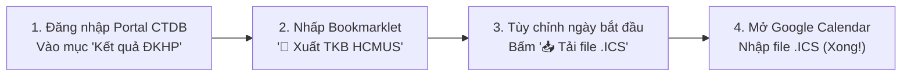

# 📅 HCMUS CTDB to Google Calendar Exporter

<p align="center">
  
  
  
  
</p>

<p align="center">
  <b>Công cụ Bookmarklet 1-click tự động đọc kết quả Đăng ký Học phần (ĐKHP) từ Portal CTDB HCMUS và xuất thời khóa biểu sang Google Calendar, Apple Calendar và Outlook.</b>
</p>

---

## ✨ Tính năng nổi bật

- ⚡ **Tiện lợi 1-Click (Bookmarklet)**: Không cần cài tiện ích mở rộng (Extension), không cần cài đặt phần mềm bên ngoài. Chạy ngay trên thanh Bookmark của mọi trình duyệt (Chrome, Edge, Cốc Cốc, Firefox, Safari, Brave,...).
- 🧠 **Phân tích dữ liệu thông minh**:
  - Tự động nhận diện MSSV & Họ tên sinh viên.
  - Tự động đọc Mã môn học, Tên môn học, Mã lớp học phần, Số tín chỉ, Học kỳ.
  - Tách riêng biệt từng buổi **Lý thuyết** và **Thực hành**.
  - Bắt chính xác thứ trong tuần (`T2` – `T7`, `CN`), khung giờ (`07:30-11:10`, `13:30-17:10`,...) và tên phòng học (nếu có).
- 🔁 **Lặp lại chu kỳ chuẩn RFC 5545 (`RRULE`)**:
  - Tạo file `.ics` có lệnh `RRULE:FREQ=WEEKLY;COUNT=15`, tự động lặp lại hàng tuần đúng ngày giờ cho cả 15 tuần học kỳ.
  - Tùy chỉnh linh hoạt số tuần: 15 tuần (chuẩn), 16 tuần, 10 tuần (học kỳ hè),...
- ⏰ **Thông báo nhắc giờ học**:
  - Nhúng sẵn chuông nhắc nhở (`VALARM`) trước giờ học: 15 phút, 30 phút, 1 tiếng hoặc tắt.
- 📱 **Đồng bộ hóa đa nền tảng**:
  - Nhập vào Google Calendar sẽ tự động đồng bộ sang điện thoại **Android, iPhone, iPad, Apple Watch, máy tính Windows, Mac**.
- 🔒 **Bảo mật tuyệt đối (100% Client-Side)**:
  - Mã nguồn chạy hoàn toàn offline trên trình duyệt của bạn. **Không gửi dữ liệu đi bất kỳ máy chủ bên thứ ba nào**. Thông tin thời khóa biểu của bạn luôn riêng tư 100%.

---


## 🚀 Hướng dẫn cài đặt

### Cách 1: Kéo & Thả (Khuyên dùng - Nhanh nhất)

1. Tải repository về máy hoặc mở file `installer.html` trong trình duyệt.
2. Nhấn `Ctrl + Shift + B` (hoặc `Cmd + Shift + B` trên Mac) để hiển thị thanh Bookmark của trình duyệt.
3. **Nhấn giữ chuột vào nút màu xanh "📅 Xuất TKB HCMUS" và kéo thả vào thanh Bookmark**.

---

### Cách 2: Tạo Bookmark thủ công

1. Nhấn `Ctrl + D` trên trình duyệt bất kỳ để lưu một bookmark, sau đó bấm nút **Chỉnh sửa (Edit)** (hoặc vào Quản lý dấu trang `chrome://bookmarks`).
2. Đặt tên Bookmark:
   ```text
   📅 Xuất TKB HCMUS
   ```
3. Mở file [`bookmarklet.min.js`](./bookmarklet.min.js), sao chép toàn bộ nội dung (bắt đầu bằng `javascript:...`) và dán vào ô **URL / Đường dẫn**.
4. Bấm **Lưu (Save)**.

---

### Cách 3: Chạy trực tiếp qua DevTools Console (Dành cho nhà phát triển)

Khi đang mở trang [https://portal.ctdb.hcmus.edu.vn/sinh-vien/ket-qua-dkhp](https://portal.ctdb.hcmus.edu.vn/sinh-vien/ket-qua-dkhp):
1. Nhấn `F12` (hoặc chuột phải chọn **Kiểm tra / Inspect**), chuyển sang tab **Console**.
2. Sao chép nội dung file [`bookmarklet.js`](./bookmarklet.js), dán vào và nhấn `Enter`.

---

## 📖 Hướng dẫn sử dụng & Nhập vào Google Calendar



### Bước 1: Mở trang kết quả ĐKHP
Đăng nhập vào hệ thống CTDB HCMUS và truy cập trang:  
🔗 **https://portal.ctdb.hcmus.edu.vn/sinh-vien/ket-qua-dkhp**

### Bước 2: Kích hoạt Bookmarklet
Nhấp vào bookmark **"📅 Xuất TKB HCMUS"** trên thanh dấu trang. Một bảng popup sẽ hiện lên hiển thị toàn bộ môn học đã đăng ký.

### Bước 3: Tải file .ICS
- Chọn **Thứ Hai tuần 1** (ngày bắt đầu học kỳ).
- Chọn số tuần học (mặc định **15 tuần**).
- Bấm nút **"📥 Tải file .ICS (Khuyên dùng)"**. Trình duyệt sẽ lưu file `TKB_HCMUS_...ics`.

### Bước 4: Nhập vào Google Calendar
1. Bấm nút **"🌐 Mở Google Calendar Import"** trên popup (hoặc truy cập trực tiếp [Google Calendar Cài đặt Nhập](https://calendar.google.com/calendar/u/0/r/settings/export)).
2. 💡 **Mẹo hữu ích**: Ở thanh bên trái mục *Lịch khác (Other calendars)*, bấm dấu **+** -> **Tạo lịch mới (Create new calendar)** đặt tên là `TKB HK1 2026-2027`.
3. Tại trang **Nhập & Xuất (Import & Export)**:
   - Mục **Chọn tệp từ máy tính**: Chọn file `.ics` vừa tải về.
   - Mục **Thêm vào lịch**: Chọn lịch `TKB HK1 2026-2027` vừa tạo.
   - Bấm **Nhập (Import)**.
4. **Hoàn tất!** Toàn bộ lịch học 15 tuần đã sẵn sàng trên tất cả các thiết bị của bạn! 🎉

> [!TIP]
> Việc tạo lịch riêng giúp bạn dễ dàng ẩn hoặc xóa toàn bộ lịch học của kỳ khi học kỳ kết thúc chỉ bằng 1 cú nhấp chuột, không sợ bị trộn lẫn vào các sự kiện cá nhân.

---

## 📂 Cấu trúc dự án

```text
hcmus-ctdb-to-gcal/
├── bookmarklet.js       # Mã nguồn JavaScript đầy đủ, rõ ràng và có chú thích
├── bookmarklet.min.js   # Mã nguồn rút gọn bắt đầu bằng javascript:... dùng cho Bookmark
├── bookmarklet_uri.txt  # Chuỗi URI-encoded để sử dụng nhanh
├── installer.html       # Trang hướng dẫn cài đặt trực quan và có chế độ Demo
└── README.md            # Tài liệu giới thiệu và hướng dẫn dự án
```

---

## 🛠️ Công nghệ sử dụng

- **Pure Vanilla JavaScript (ES6+)**: Không phụ thuộc bất kỳ thư viện thứ 3 nào (no jQuery, no React), đảm bảo tốc độ mở tức thì và hoạt động hoàn hảo dưới chính sách bảo mật CSP của trường.
- **iCalendar Standard (RFC 5545)**: Tương thích 100% với Google Calendar, Apple Calendar (iOS/macOS), Microsoft Outlook.
- **Responsive & Modern CSS**: Thiết kế giao diện phẳng, hiện đại với thanh cuộn mượt mà và hỗ trợ trải nghiệm tối ưu.

---

## 🤝 Đóng góp (Contributing)

Mọi ý kiến đóng góp, báo lỗi định dạng bảng hoặc đề xuất cải tiến đều được hoan nghênh:
1. Fork dự án
2. Tạo branch tính năng (`git checkout -b feature/AmazingFeature`)
3. Commit thay đổi (`git commit -m 'Add some AmazingFeature'`)
4. Push lên branch (`git push origin feature/AmazingFeature`)
5. Mở một Pull Request

---

## 📄 Bản quyền (License)

Phát hành dưới giấy phép [MIT License](./LICENSE). Hoàn toàn miễn phí vì cộng đồng sinh viên HCMUS!

---

<p align="center">
  Được phát triển với ❤️ dành cho sinh viên Trường Đại học Khoa học Tự nhiên ĐHQG-HCM.
</p>
